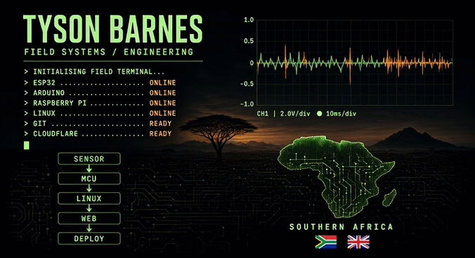

<p align="center">
  
</p>
<h1 align="center">Tyson Barnes</h1>

<p align="center">
  <strong>Instrumentation Mechanician · Automation Engineer · Embedded Systems · Field Technologist • Linux · Web</strong>
</p>

<p align="center">
  🇿🇦 &nbsp; South Africa &nbsp;&nbsp;·&nbsp;&nbsp; 🇬🇧 &nbsp; United Kingdom
</p>

From sensor and microcontroller to Linux server, application and deployed web interface.
I build useful systems where **industrial automation, embedded electronics, software and the physical world** meet.

Red Seal Instrumentation Mechanician with more than a decade of experience in process control, mining and aluminium smelting. I also build small web systems, Arduino instruments, field-computing tools and practical hardware—often entirely from an Android phone using Termux.

Based between England & South Africa.

---


<p align="center">
  
</p>

---

## What I work on

```text
INDUSTRIAL        PLCs · instrumentation · process control · commissioning
EMBEDDED          Arduino · sensors · data logging · control systems
FIELD COMPUTING   Linux · Termux · low-power hardware · remote monitoring
WEB               Hugo · Git · Cloudflare · static systems · JavaScript
DESIGN            AutoCAD · Fusion 360 · 3D printing · practical fabrication
RELIABILITY       condition monitoring · oil analysis · diagnostics
```

## Current fieldwork

- Building and deploying complete Hugo websites from Android with **Termux, GitHub and Cloudflare**
- Developing compact calculators and technical utilities for **The Internet Shed**
- Exploring remote sensing, low-power field stations and practical environmental telemetry
- Designing industrial reliability systems for contamination control and condition monitoring
- Documenting engineering, natural history and photography from KwaZulu-Natal

## Selected systems

### 📟 Field Terminal
**Engineering from the device in your pocket.**

Android → Termux → Git → Hugo → Cloudflare

Documentation and practical projects for building, publishing,
diagnosing networks and interfacing with hardware from Android.

`Android` `Termux` `Linux` `Hugo` `Cloudflare`

---

### 🌾 VeldOS
**Local-first property intelligence.**

Sensors → LoRa → Linux → Dashboard

A developing architecture for property telemetry, water,
power and equipment monitoring.

`LoRa` `ESP32` `Linux` `MQTT` `Node-RED`

---

### Field Internet

A small, efficient field website covering engineering, natural history, photography and experiments. Built with Hugo and published from an Android phone.

`Hugo` `Go Templates` `Termux` `Git` `Cloudflare`

### The Internet Shed

A mechanical-interface collection of genuinely useful browser tools: battery runtime, voltage drop, daylight remaining, shadow length, campsite power, antenna length and other field calculations.

`JavaScript` `Progressive Enhancement` `Offline-first` `Static Web`

### Arduino & instrumentation bench

Embedded experiments joining sensors, signal conditioning, control logic and useful physical outputs. The emphasis is measurement integrity, maintainability and clear documentation—not novelty for its own sake.

`Arduino` `C/C++` `Sensors` `Control` `Data Logging`

### Industrial reliability intelligence

Architecture for combining particle, moisture, dielectric, temperature, pressure, differential-pressure, vibration, ferrous-wear, GPS and CAN data into practical maintenance decisions.

`Instrumentation` `IIoT` `Condition Monitoring` `Reliability`

## Technical range

| Domain | Working knowledge |
|---|---|
| Automation | Rockwell Studio 5000, ControlLogix, PLC fault-finding, commissioning |
| Instrumentation | measurement, calibration, sensors, loops, process diagnostics |
| Embedded | Arduino, C/C++, sensor integration, logging, simple control |
| Web | Hugo, HTML, CSS, JavaScript, GitHub, Cloudflare Workers/Pages |
| Systems | Linux, Termux, networking, DNS, TLS, SSH, deployment workflows |
| Design | AutoCAD, Fusion 360, Unreal Engine, 3D printing |
| Reliability | contamination control, condition monitoring, telemetry architecture |

## How I build

1. Observe the real system.
2. Define the useful outcome.
3. Build the smallest dependable version.
4. Measure what it actually does.
5. Document it so another human can reproduce it.

> Useful beats fashionable. Working beats impressive. Documented beats mysterious.

## Repository map

The strongest repositories here will be organised into four working shelves:

- **AUTOMATION** — PLC, instrumentation and process-control references
- **EMBEDDED** — Arduino, sensors, data loggers and field instruments
- **FIELD SYSTEMS** — Linux, Termux, networking and low-power computing
- **WEB WORKS** — Hugo websites, calculators and browser experiments

## Contact

- Website: coming soon
- Location: Richards Bay, South Africa

---

<sub>Most of my recent web work was designed, built, tested and deployed from a Samsung phone—without a laptop.</sub>
